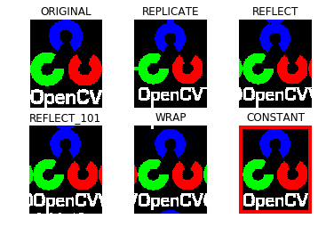
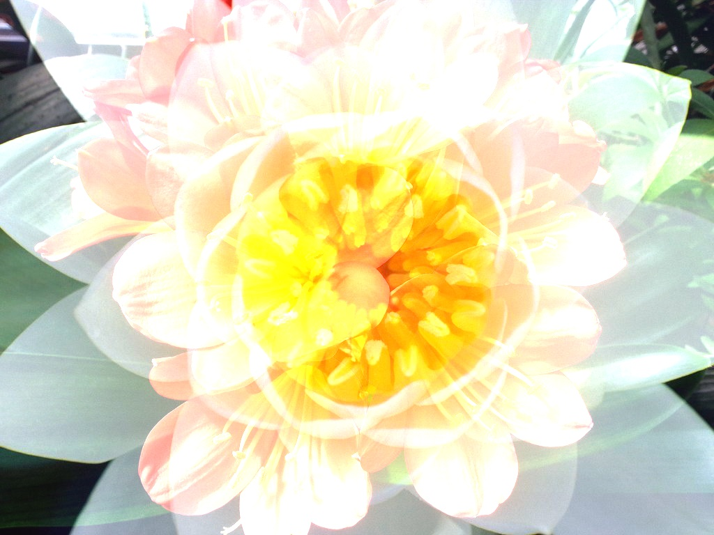
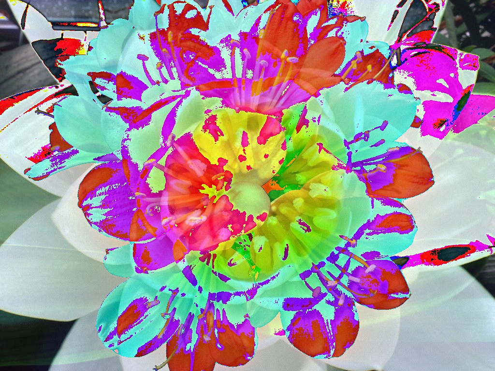

## 참조링크

- [한글 번역본](<https://opencv-python.readthedocs.io/en/latest/doc/06.operation/operation.html>)
- [영문 원본](<https://opencv-python-tutroals.readthedocs.io/en/latest/py_tutorials/py_core/py_basic_ops/py_basic_ops.html>)


## 튜토리얼

### Basic Operation(Basic Operations on Images)

- basic_operation.py

- 목표
  - 픽셀 값에 접근하고 수정할 수 있다.
  - 이미지의 기본 속성을 확인할 수 있다.
  - 이미지의 ROI(Region of Image)를 설정할 수 있다.
  - 이미지를 분리하고 합칠 수 있다.

- 픽셀에 접근하고 수정하기(Accessing and Modifying pixel values)

  ```bash
  # 이미지 로드하기
  >>> import cv2
  >>> import numpy as np
  >>> img = cv2.imread('img/lena.jpg')
  
  # 특정 pixel 값에 접근
  >>> px = img[100,200]
  >>> print(px)
  [157 100 190]
  
  # blue pixel만 접근
  >>> b = img[100,200,0]
  >>> print(b)
  157
  
  # 특정 pixel 값 수정
  >>> img[100,100] = [255,255,255]
  >>> print(img[100,100])
  [255 255 255]
  
  # numpy를 이용한 접근과 수정 - b,g,r 중 하나의 값만 접근가능
  >>> img.item(10,10,2) # Red값
  59
  >>> img.itemset((10,10,2), 100) #Red값을 100으로 변경
  >>> img.item(10,10,2)
  100
  ```

- 이미지 속성에 접근하기(Accessing Image Properties)

  - `img.shape`
    - tuple 형태로(형,렬, channel) 정보를 리턴함
  - `img.size`
    - 전체 pixel수 확인
  - img.dtype
    - 이미지의 Datatype 확인

  ```bash
  # 이미지 속성 접근하기
  >>> print(img.shape)
  (342, 548, 3)
  
  >>> print(img.size)
  562248
  
  >>> print(img.dtype)
  uint8
  ```

- 이미지 ROI(Image ROI)

  - 이미지 작업시에는 특정 pixel 단위보다는 특정 영역단위로 작업을 하게됨
  - 이것을 Region of Image(ROI)라고 함
  - ROI 설정은 Numpy의 indexing 방법을 사용함

  ```python
  import cv2
  
  img = cv2.imread('img/baseball-player.jpg')
  cv2.imshow('img', img)
  cv2.waitKey(0)
  
  # img[행의 시작점: 행의 끝점, 열의 시작점: 열의 끝점]
  ball = img[435:480, 817:884]
  img[490:535, 817:884] = ball # 다른 영역에 paste
  cv2.imshow('img', img)
  cv2.waitKey(0)
  cv2.destroyAllWindows()
  
  ```

- 이미지 Channel

  - Color Image는 3개의 B,G,R로 구성이 되어 있으며, 이것을 각 채널별로 분리할 수 있음
  - 개별적인 채널들은 다시 합쳐질 수도 있음

  ```bash
  # 채널 분리 및 합치기
  >>> b, g, r= cv2.split(img)
  >>> img = cv2.merge((r,g,b))
  
  # Numpy indexing 접근 방법으로 표현
  # cv2.split()은 비용이 많이 드는 함수이기 때문에
  # numpy indexing 방법을 사용하는 것이 효율적
  >>> b = img[:,:,0] # 0 : Blue, 1 : Green, 2 : Red
  >>> img[:,:,2] = 0 # Red Channel을 0으로 변경. Red 제거하는 효과.
  ```


- 이미지에 테두리 만들기(Making Borders for Images(Padding))
  - `cv2.copyMakeBorder(src, top, bottom, left, right, borderType)`
    - src - 이미지
    - top, bottom, left, right - 각 방향별 픽셀 두께
    - borderType - 테두리 타입
      - cv2.BORDER_CONSTANT
      - cv2.BORDER_REFLECT
      - cv2.BORDER_REFLECT_101 or cv2.BORDER_DEFAULT
      - cv2.BORDER_REPLICATE
      - cv2.BORDER_WRAP




### 이미지 연산(Arithmetic Operations on Images)

- 목표

  - 이미지의 더하기, 빼기, 비트연산에 대해서 알 수 있다.
  - cv2.add(), cv.addWeighted() 함수에 대해 알 수 있다.

- 이미지 더하기(Image Addition)

  - 더하는 방법은 cv2.add() 연산과 Numpy 연산(img1 + img2)으로 하는 방법이 있음
  - 더한다는 것은 같지만 결과는 다르게 나옴
  - `cv2.add()`
    - Saturation 연산
    - 한계값을 정하고 그 값을 벗어나는 경우는 모두 특정 값으로 계산하는 방식
    - 이미지에서 0이하는 모두 0, 255이상은 모두 255로 표현

  

  - Numpy(img1 + img2)
    - modulo 연산
    - a와 b는 n으로 나눈 나머지 값이 같다라는 의미
    - 이미지에서는 연산의 결과가 256보다 큰 경우는 256으로 나눈 나머지 값으로 결정함

  

  ```bash
  
  >>> import numpy as np
  >>> x = np.uint8([250])
  >>> y = np.uint8([10])
  
  >>> print(cv2.add(x,y)) # 250+10 = 260 => 255
  [[255]]
  
  >>> print(x+y)          # 250+10 = 260 % 256 = 4
  [4]
  ```

  

- 이미지 Blending

  - 이미지를 합칠 때 가중치를 두어 합치는 방법

  ```python
  import cv2
  
  img1 = cv2.imread('img/flower1.jpg')
  img2 = cv2.imread('img/flower2.jpg')
  
  def nothing(x):
      pass
  
  cv2.namedWindow('image')
  cv2.createTrackbar('W', 'image', 0, 100, nothing)
  
  while True:
      w = cv2.getTrackbarPos('W', 'image')
      dst = cv2.addWeighted(img1, float(100-w) * 0.01, img2, float(w)* 0.01, 0)
      cv2.imshow('image', dst)
      
      if cv2.waitKey(1) & 0xFF == 27:
          break
      
  cv2.destroyAllWindows()
  ```

- 비트연산(Bitwise Operations)


