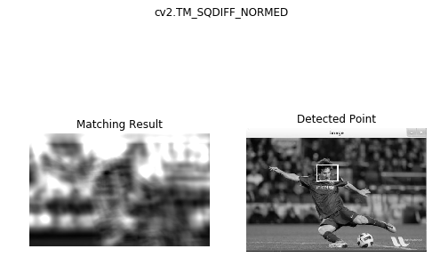
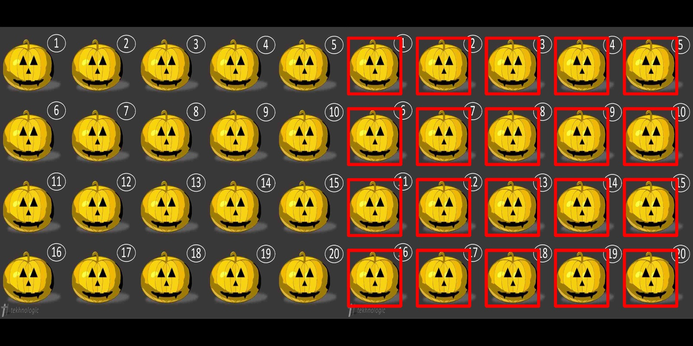

## 참조링크

- [한글 번역본](<https://opencv-python.readthedocs.io/en/latest/doc/08.imageProcessing/imageProcessing.html>)
- [영문 원본](<https://opencv-python-tutroals.readthedocs.io/en/latest/py_tutorials/py_imgproc/py_table_of_contents_imgproc/py_table_of_contents_imgproc.html>)


## 튜토리얼

### 이미지 Processing

- image_processing.py

- 목표
  - 디지털 영상의 표현 방법에 대해서 알 수 있다.
  - Color-space 중 Binary Image, Grayscale, RGB, HSV에 대해서 알 수 있다.
  - 각 Color-space 변환 방법에 대해서 알 수 있다.
  - 동영상에서 간단한 Object Tracking을 할 수 있다.
  - cv2.cvtColor(), cv2.inRange() 함수에 대해서 알 수 있다.
- Digital Image
  - 디티절 영상은 2차원 행렬의 형태로 표현이 됨
  - 각 격자가 하나의 pixel이 되고 이를 bitmap image라고 함
  - 각 pixel의 위치는 2가지 형태로 표현을 할 수가 있는데, 영상좌표와 행렬 위치로 표현이 됨
    - 영상 좌표 -> (x, y)
    - 행렬 위치 -> (r, c)
- Digital Image의 유형
  - Binary Image
    - pixel당 1bit로 표현하는 영상
    - 흰색과 검은색으로만 표현이 되는 영상
    - dithering : binary image의 밀도를 조절하여 밝기를 표현하는 방법
- Grayscale Image

  - pixel당 8bit, 즉 256단계의 명암(빛의 세기)를 표현할 수 있는 이미지
- Color Image
  - pixel의 색을 표현하기 위해 pixel당 24bit를 사용함(총 16,777,216 색)
  - pixel은 RGB 각각을 위해서 8bit를 사용하게 됨
  - 각 pixel당 3byte를 사용하기 때문에 용량이 큼
    - 이를 해결하기 위해 lookup table을 사용하여, 해당 pixel에는 index만을 저장하기도 함
- RGB Color-space
  - 빛의 삼원색인 빨간색, 초록색, 파란색을 기본 색으로 사용을 함
  - 정육면체 모델 형태로 표현할 수 있음
- HSV Color-space
  - 이미지 처리에서 가장 많이 사용되는 형태의 Color 모델
  - 하나의 모델에서 색과 채도, 명도를 모두 알 수 있음
    - H(ue) : 색상. 일반적인 색을 의미함. 원추모형에서 각도로 표현이 됨.
    - S(aturation) : 채도. 색의 순수성을 의미하며 일반적으로 짙다, 흐리다로 표현이 됨. 중심에서 바깥쪽으로 이동하면 채도가 높음.
    - V(alue) : 명도. 색의 밝고 어두운 정도. 수직축의 깊으로 표현. 어둡다 밝다로 표현이 됨.

- Color-space 변환

  - `cv2.cvtColor(src, code)`

    - src - image
    - code - 변환 코드

  - 목록 확인

    ```python
    >>> import cv2
    >>> flags = [i for i in dir(cv2) if i.startswith('COLOR_')]
    >>> print(flags)
    ```

  - BGR -> Grayscale로 변환 : cv2.COLOR_BGR2GRAY

  - BGR -> HSV로 변환 : cv2.COLOR_BGR2HSV

- Object Tracking

  - 영상에서 파란색 부분을 찾아서 binary image로 보여줌
  - 절차
    - Video로부터 Frame을 읽어 들임
    - frame을 HSV로 변환
    - 변환한 이미지에서 blue 영역을 찾아서 mask를 생성
    - frame에 mask를 적용하여 이미지를 보여줌

  ```python
  
  import cv2
  import numpy as np
  
  # Camera 객체를 생성 후 사이즈로 320 x 240으로 조정
  cap = cv2.VideoCapture(0)
  cap.set(3, 320)
  cap.set(4, 240)
  
  while(1):
      # camera에서 frame capture
      ret, frame = cap.read()
      
      if ret:
          # BGR -> HSV로 변환
          hsv = cv2.cvtColor(frame, cv2.COLOR_BGR2HSV)
          
          # blue 영역의 from ~ to
          lower_blue = np.array([110, 50, 50])
          upper_blue = np.array([130, 255, 255])
          
          # 이미지에서 blue 영역
          mask = cv2.inRange(hsv, lower_blue, upper_blue)
          
          # bit 연산자를 통해서 blue 영역만 남김
          res = cv2.bitwise_and(frame, frame, mask=mask)
          
          cv2.imshow('frame', frame)
          cv2.imshow('mask', mask)
          cv2.imshow('res', res)
          
      if cv2.waitKey(1) & 0xFF == 27:
          break
      
  cap.release()
  cv2.destroyAllWindows()
  ```


### 이미지 임계처리

- 목표

  - 이미지 이진화의 방법인 Simple thresholding, Adaptive thresholding, Otsu's thresholding에 대해서 알 수 있다.
  - cv2.threshold(), cv2.adaptiveThreshold() 함수에 대해서 알 수 있다.

- 기본 임계처리

  - 이진화 : 영상을 흑/백으로 분류하여 처리하는 것
  - 이진화를 할 때 기준이되는 임계값을 어떻게 결정할 것인지가 중요한 문제가 됨
    - 임계값보다 크면 백, 작으면 흑
  - 기본 임계처리는 사용자가 고정된 임계값을 결정하고 그 결과를 보여주는 단순한 형태
  - `cv2.threshold(src, thresh, maxval, type) -> retval, dst`
    - src - image : single-channel 이미지(grayscale 이미지)
    - thresh - 임계값
    - maxval - 임계값을 넘었을 때 적용할 value
    - type - thresholding type
      - cv2.THRESH_BINARY
      - cv2.THRESH_BINARY_INV
      - cv2.THRESH_TRUNC
      - cv2.THRESH_TOZERO
      - cv2.THRESH_TOZERO_INV

  

  - 예제

  ```python
  import cv2
  import numpy as np
  from matplotlib import pyplot as plt
  
  img = cv2.imread('img/squirrel.jpg', 0)
  
  # 사이즈 조정
  h, w = img.shape
  r = 300/w
  dim = (int(r*w), int(r*h))
  img_resize = cv2.resize(img, dim)
  
  cv2.imshow('img', img_resize)
  cv2.waitKey(0)
  cv2.destroyAllWindows()
  
  
  ret, thresh1 = cv2.threshold(img,127,255, cv2.THRESH_BINARY)
  ret, thresh2 = cv2.threshold(img,127,255, cv2.THRESH_BINARY_INV)
  ret, thresh3 = cv2.threshold(img,127,255, cv2.THRESH_TRUNC)
  ret, thresh4 = cv2.threshold(img,127,255, cv2.THRESH_TOZERO)
  ret, thresh5 = cv2.threshold(img,127,255, cv2.THRESH_TOZERO_INV)
  
  titles =['Original','BINARY','BINARY_INV','TRUNC','TOZERO','TOZERO_INV']
  images = [img,thresh1,thresh2,thresh3,thresh4,thresh5]
  
  for i in range(6):
      plt.subplot(2, 3, i+1), plt.imshow(images[i], 'gray')
      plt.title(titles[i])
      plt.xticks([]),plt.yticks([])
      
  plt.show()
  
  ```


- 적응 임계처리

  - 기본 임계처리의 경우 임계값을 이미지 전체에 적용하여 처리하기 때문에 이미지에 음영이 다르면 일부 영역이 모두 흰색 또는 검정색으로 보여지게 됨
  - 이런 문제를 해결하기 위해 이미지의 작은 영역별로 thresholding을 함
    - cv2.adaptiveThreshold() 함수 사용
  - `cv2.adaptiveThreshold(src, maxValue, adaptiveMethod, thresholdType, blockSize, C)`
    - src - grayscale image
    - maxValue - 임계값
    - adaptiveMethod - thresholding value를 결정하는 계산 방법
      - cv2.ADAPTIVE_THRESH_MEAN_C : 주변영역의 평균값으로 결정
      - cv2.ADAPTIVE_THRESH_GAUSSIAN_C :
    - thresholdType - thresholding을 적용할 영역 사이즈
    - C - 평균이나 가중평균에서 차감할 값

  ```python
  import cv2
  from matplotlib import pyplot as plt
  
  img = cv2.imread('img/squirrel.jpg', 0)
  # img = cv2.medianBlur(img, 5)
  
  ret, th1 = cv2.threshold(img, 127, 255, cv2.THRESH_BINARY)
  
  th2 = cv2.adaptiveThreshold(img, 255, cv2.ADAPTIVE_THRESH_MEAN_C, cv2.THRESH_BINARY, 15, 2)
  th3 = cv2.adaptiveThreshold(img, 255, cv2.ADAPTIVE_THRESH_GAUSSIAN_C, cv2.THRESH_BINARY, 15, 2)
  
  titles = ['Original', 'Global', 'Mean', 'Gaussian']
  
  images = [img, th1, th2, th3]
  
  for i in range(4):
      plt.subplot(2, 2, i+1), plt.imshow(images[i], 'gray')
      plt.title(titles[i])
      plt.xticks([]), plt.yticks([])
      
  plt.show()
  ```

  


### 이미지의 기하학적 변형

-  image_transformations.py

- 목표

  - 기하학적 변형에 대해서 알 수 있다.
  - cv2.getPerspectiveTransform() 함수에 대해서 알 수 있다.

- Transformations(변환)

  - 변환이란 수학적으로 표현하면 다음과 같다

    -> 좌표 x를 좌표 x'로 변환하는 함수

  - 예로는 사이즈 변경(Scaling), 위치변경(Translation), 회전(Rotation) 등이 있다

- 변환의 종류

  - 강체변환(Ridid-Body) : 크기 및 각도가 보존(ex; Translation, Rotation)
  - 유사변환(Similarity) : 크기는 변하고 각도는 보존(ex; Scaling)
  - 선형변환(Linear) : Vector 공간에서의 이동. 이동변환은 제외
  - Affine : 선형변환과 이동변환까지 포함. 선의 수평선은 유지(ex; 사각형 -> 평행사변형)
  - Perspective : Affine 변환에 수평성도 유지되지 않음. 원근변환

- **Scaling**

  - Scaling은 이미지의 사이즈가 변하는 것
  - OpenCV에서는 cv2.resize() 함수를 사용하여 적용할 수 있음
  - 사이즈가 변하면 pixel 사이의 값을 결정해야 하는데, 이 때 사용하는 것을 보간법(Interpolation method)라고 함
    - 사이즈를 줄일 때 : cv2.INTER_AREA
    - 사이즈를 크게 할 때 : cv2.INTER_CUBIC, cv2.INTER_LINEAR
  - `cv2.resize(img, dsize, fx, fy, interpolation)`
    - img - image
    - dsize - Manual Size, 가로, 세로 형태의 tuple(ex; (100,200))
    - fx - 가로 사이즈의 배수. 2배로 크게하려면 2, 반으로 줄이려면 0.5
    - fy - 세로 사이즈의 배수
    - interpolation - 보간법

  ```python
  import cv2
  
  img = cv2.imread('img/logo.png')
  
  # 행 : Height, 열 : Width
  height, width = img.shape[:2]
  
  # 이미지 축소
  shrink = cv2.resize(img, None, fx=0.5, fy=0.5, interpolation=cv2.INTER_AREA)
  
  # Manual Size 지정
  zoom1 = cv2.resize(img, (width*2, height*2), interpolation=cv2.INTER_CUBIC)
  
  # 배수 Size 지정
  zoom2 = cv2.resize(img, None, fx=2, fy=2, interpolation=cv2.INTER_LINEAR)
  
  cv2.imshow('Original', img)
  cv2.imshow('Shrink', shrink)
  cv2.imshow('Zoom1', zoom1)
  cv2.imshow('Zoom2', zoom2)
  
  cv2.waitKey(0)
  cv2.destroyAllWindows()
  ```

  

- **Translation**

  - 이미지의 위치를 변경하는 변환
  - `cv2.warpAffine(src, M, dsize)`
    - src - Image
    - M - 변환 행렬
    - dsize(tuple) - ouput image size(ex; (width=colums, height=rows))

  ```python
  import cv2
  import numpy as np
  
  img = cv2.imread('img/logo.png')
  
  rows, cols = img.shape[:2]
  
  # 변환 행렬, x축으로 10, Y축으로 20 이동
  M = np.float32([[1, 0, 10], [0, 1, 20]])
  
  dst = cv2.warpAffine(img, M, (cols, rows))
  cv2.imshow('Original', img)
  cv2.imshow('Translation', dst)
  
  cv2.waitKey(0)
  cv2.destroyAllWindows()
  ```

  

- **Rotation**

  - 물체를 평면상의 한 점을 중심으로 @만큼 회전하는 변환
  - 양의 각도는 시계반대 방향으로 회전을 함
  - 변환 행렬이 필요한데, 변환 행렬을 생성하는 함수가 cv2.getRotationMatrix2D()
  - `cv2.getRotationMatrix2D(center, angle, scale) -> M`
    - center - 이미지 중심 좌표
    - angle - 회전 각도
    - scale - scale factor

  ```python
  import cv2
  
  img = cv2.imread('img/logo.png')
  
  rows, cols = img.shape[:2]
  
  # 이미지의 중심점을 기준으로 90도 회전하면서 0.5배 Scale
  M = cv2.getRotationMatrix2D((cols/2, rows/2), 90, 0.5)
  
  dst = cv2.warpAffine(img, M, (cols, rows))
  
  cv2.imshow('Original', img)
  cv2.imshow('Rotations', dst)
  
  cv2.waitKey(0)
  cv2.destroyAllWindows()
  ```

  

- Affine Transformation

  - 선의 평행선은 유지가 되면서 이미지를 변환하는 작업
  - 이동, 확대, Scale, 반전까지 포함된 변환
  - Affine 변환을 위해서는 3개의 Match가 되는 점이 있으면 변환행렬을 구할 수 있음

  ```python
  import cv2
  import numpy as np
  from matplotlib import pyplot as plt
  
  img = cv2.imread('img/chessboard.jpg')
  
  # RGB -> BGR로 변환
  img = cv2.cvtColor(img, cv2.COLOR_RGB2BGR)
  
  rows, cols, ch = img.shape
  
  pts1 = np.float32([[200, 100], [400, 100], [200, 200]])
  pts2 = np.float32([[200, 300], [400, 200], [200, 400]])
  
  # pts1의 좌표에 표시. Affine 변환 후 이동 점 확인
  cv2.circle(img, (200, 100), 10, (255, 0, 0), -1)
  cv2.circle(img, (400, 100), 10, (0, 255, 0), -1)
  cv2.circle(img, (200, 200), 10, (0, 0, 255), -1)
  
  M = cv2.getAffineTransform(pts1, pts2)
  
  dst = cv2.warpAffine(img, M, (cols, rows))
  
  plt.subplot(121), plt.imshow(img), plt.title('image')
  plt.subplot(122), plt.imshow(dst), plt.title('Affine')
  plt.show()
  ```


- **Perspective Tranformation**

  - Perspective(원근법) 변환
  - 직선의 성질만 유지되고, 선의 평행성은 유지가 되지 않는 변환
    - 기차길은 서로 평행하지만 원근변환을 거치면 평행성은 유지되지 못하고 하나의 점에서 만나는 것처럼 보임
  - 4개의 Point의 Input값과 이동할 Output Point가 필요
  - 변환 행렬을 구하기 위해서는 cv2.getPerspectiveTransform() 함수가 필요하며, cv2.warpPerspective() 함수에 변환행렬값을 적용하여 최종 결과 이미지를 얻을 수 있음

  ```python
  import cv2
  import numpy as np
  from matplotlib import pyplot as plt
  
  img_origin = cv2.imread('img/perspective.jpg')
  img = cv2.cvtColor(img, cv2.COLOR_RGB2BGR)
  
  # [x, y] 좌표점을 4x2의 행렬로 작성
  # 좌표점은 좌상 -> 좌하 -> 우상 -> 우하
  pts1 = np.float32([[414, 393], [75, 745], [489, 393], [245, 745]])
  
  # 좌표의 이동점
  pts2 = np.float32([[100, 100], [100, 800], [800, 100], [800, 800]])
  
  # pts1의 좌표에 표시. perspective 변환 후 이동 점 확인
  cv2.circle(img, (414, 393), 20, (255,0,0), -1)
  cv2.circle(img, (75, 745), 20, (0,255,0), -1)
  cv2.circle(img, (489, 393), 20, (0,0,255), -1)
  cv2.circle(img, (245, 745), 20, (0,0,0), -1)
  
  M = cv2.getPerspectiveTransform(pts1, pts2)
  
  dst = cv2.warpPerspective(img, M, (1500, 1000))
  
  plt.subplot(121), plt.imshow(img), plt.title('image')
  plt.subplot(122), plt.imshow(dst), plt.title('Perspective')
  plt.show()
  ```


### Image Smoothing

- image_smoothing.py

- 목표

  - 다양한 Filter를 이용하여 Blur 이미지를 만들 수 있다.
  - 사용자 정의 Filter를 적용할 수 있다.

- Image Filtering

  - 이미지도 음성 신호처럼 주파수로 표현할 수 있슴
    - 일반적으로 고주파는 밝기의 변화가 많은 곳, 즉 경계선 영역에서 나타나며, 일반적인 배경은 저주파로 나타남
    - 이것을 바탕으로 고주파를 제거하면 Blur 처리가 되며, 저주파를 제거하면 대상의 영역을 확인할 수 있음
  - Low-pass filter(LPF)와 High-pass filter(HPF)를 이용하며, LPF를 적용하면 노이즈 제거나 blur 처리를 할 수 있으며, HPF를 적용하면 경계선을 찾을 수 있음
  - OpenCV에서는 cv2.filter2D() 함수를 이용하며 이미지에 kernel(filter)를 적용하여 이미지를 Filtering 할 수 있음
  - Filter가 적용되는 방법
    - 이미지의 각 pixel에 kernel을 적용함
    - 5x5 kernel인 경우에 각 pixel에 5x5윈도우를 올려놓고, 그 영역안에 포함되는 값의 Sum을 한 후에 25로 나눔
    - 그 결과는 해당 윈도우 영역안의 평균값이 되고, 그 값을 해당 pixel에 적용하는 방식
  - kernel 사이즈를 조정하면서 결과를 확인할 수 있는 예제

  ```python
  import cv2
  import numpy as np
  
  def nothing(x):
      pass
  
  img = cv2.imread('img/squirrel.jpg')
  
  # 사이즈 조정
  h, w = img.shape[:2]
  r = 900/w
  dim = (int(r*w), int(r*h))
  img = cv2.resize(img, dim)
  
  cv2.namedWindow('image')
  cv2.createTrackbar('K', 'image', 1, 20, nothing)
  
  while(1):
      if cv2.waitKey(1) & 0xFF == 27:
          break
      k = cv2.getTrackbarPos('K', 'image')
      
      # (0, 0)이면 에러가 발생함으로 1로 치환
      if k == 0:
          k = 1
          
      # trackbar에 의해서 (1,1) ~ (20,20) kernel 생성
      kernel = np.ones((k,k), np.float32) / (k**2)
      dst = cv2.filter2D(img, -1, kernel)
      
      cv2.imshow('image', dst)
      
  cv2.destroyAllWindows()
  ```

  

- Image Blurring

  - Image Blurring은 low-pass filter를 이미지에 적용하여 얻을 수 있음
  - 고주파 영역을 제거함으로써 노이즈를 제거하거나 경계선을 흐리게 할 수 있음
  - **Averaging**
    - Box 형태의 kernel을 이미지에 적용한 후 평균값을 box의 중심점에 적용하는 형태
    - cv2.blur() 또는 cv2.boxFilter() 함수로 적용할 수 있음
    - `cv2.blur(src, ksize)`
      - src - channel 수는 상관 없으나, depth(Data Type)은 CV_8U, CV_16U, CV_16S, CV_32F or CV_64F
      - ksize - kernel 사이즈(ex; (3,3))
  - **Gaussian Filtering**
    - box filter는 동일한 값으로 구성된 kernel을 사용하지만, Gaussian Filter는 Gaussian 함수를 이용한 Kernel을 적용함
      - kernel 행렬의 값을 Gaussian 함수를 통해서 수학적으로 생성하여 적용
      - kernel의 사이즈는 양수이면서 홀수로 지정을 해야함
      - 이미지의 Gaussian Noise(전체적으로 밀도가 동일한 노이즈, 백색노이즈)를 제거하는데 가장 효과적
    - `cv2.GaussianBlur(img, ksize, sigmaX)`
      - img - channel 수는 상관 없으나, depth(Data Type)은 CV_8U, CV_16U, CV_16S, CV_32F or CV_64F
      - ksize - (width, height) 형태의 kernel size. width와 height은 서로 다를 수 있지만, 양수의 홀수로 지정해야 함
      - sigmaX - Gaussian kernel standard deviation in X direction
  - **Median Filtering**
    - kernel window와 pixel의 값들을 정렬한 후에 중간값을 선택하여 적용
      - salt-and-pepper noise 제거에 효과적
    - `cv2.medianBlur(src, ksize)`
      - src - 1,3,4 channel image. depth가 CV_8U, CV_16U, or CV_32F이면 ksize는 3또는 5, CV_8U이면 더 큰 ksize 가능
      - ksize - 1보다 큰 홀수
  - **Bilateral Filtering**
    - 지금까지의 Blur처리는 경계선까지 Blur 처리가되어 경계선이 흐려지게 됨
    - Bilateral Filtering(양방향 필터)은 경계선을 유지하면서 Gaussian Blur 처리를 해주는 방법
      - Gaussian 필터를 적용하고, 또 하나의 Gaussian 필터를 주변 pixel까지 고려하여 적용하는 방식
    - `cv2.bilateralFilter(src, d, sigmaColor, sigmaSpace)`
      - src - 8-bit, 1 or 3 Channel image
      - d - filtering시 고려할 주변 pixel 지름
      - sigmaColor - Color를 고려할 공간. 숫자가 크면 멀리 있는 색도 고려함
      - sigmaSpace - 숫자가 크면 멀리 있는 pixel도 고려함

  ```python
  import cv2
  import numpy as np
  from matplotlib import pyplot as plt
  
  img = cv2.imread('img/squirrel.jpg')
  
  # pyplot을 사용하기 위해 BGR을 RGB로 변환
  b,g,r = cv2.split(img)
  img = cv2.merge([r,g,b])
  
  # 일반 Blur
  dst1 = cv2.blur(img, (7,7))
  
  # GaussianBlur
  dst2 = cv2.GaussianBlur(img, (5,5), 0)
  
  # Median Blur
  dst3 = cv2.medianBlur(img, 9)
  
  # Bilateral Filtering
  dst4 = cv2.bilateralFilter(img, 9, 75, 75)
  
  images = [img, dst1, dst2, dst3, dst4]
  titles = ['Original', 'Blur(7X7)', 'Gaussian Blur(5X5)', 'Median Blur', 'Bilateral']
  
  for i in range(5):
      plt.subplot(3, 2, i+1), plt.imshow(images[i]), plt.title(titles[i])
      plt.xticks([]), plt.yticks([])
      
  plt.show()
  ```

  


### Morphological Transformations(형태론적 변환)

- morphological_transformations.py

- 목표 
  - Morphological 방법인 Erosion, Dilation, Opening, Closing에 대해서 알 수 있다.
  - cv2.erod(), cv2.dilate(), cv2.morphologyEx() 함수에 대해서 알 수 있다.
- **Theory**
  - Morphological Transformation은 이미지를 Segmentation 하여 단순화, 제거, 보정을 통해서 형태를 파악하는 목적으로 사용이 됨
    - 일반적으로 binary나 grayscale image에 사용이 됨
    - 사용하는 방법으로는 Dilation(팽창), Erosion(침식) 그리고 2개를 조합한 Opening과 Closing이 있음
    - 2가지 Input 값(원본이미지, structuring element)
      - structuring element
        - 원본이미지에 적용되는 kernel, 중심을 원점으로 사용할 수도 있고, 원점을 변경할 수도 있음
        - 일반적으로 꽉찬 사각형, 타원형, 십자형을 많이 사용함
- **Erosion(침식)**
  - 각 Pixel에 structuring element를 적용하여 하나라도 0이 있으면, 대상 pixel을 제거하는 방법
  - **이 방법은 작은 Object를 제거하는 효과가 있음**
  - `cv2.erode(src, kernel, dst, anchor, iterations, borderType, borderValue)`
    - src - the depth should be one of CV_8U, CV_16U, CV_16S, CV_32F or CV_64F.
    - kernel - structuring element. cv2.getStructuringElement() 함수로 만들 수 있음
    - anchor - structuring element의 중심. default (-1, -1)로 중심점
    - iterations - erosion 적용 반복 횟수


- **Dilation(팽창)**
  - Erosion과 반대로 확장한 후 작은 구멍을 채우는 방법
  - Erosion과 마찬가지로 각 pixel에 structuring element를 적용함
    - 대상 pixel에 대해서 OR 연산을 수행함
    - 겹치는 부분이 하나라도 있으면 이미지를 확장함
  - **경계가 부드러워지고 구멍이 메꿔지는 효과**
  - `cv2.dilation(src, kernel, dst, anchor, iterations, borderType, borderValue)`
    - src – the depth should be one of CV_8U, CV_16U, CV_16S, CV_32F or CV_64F.
    - kernel – structuring element. `cv2.getStructuringElemet()` 함수로 만들 수 있음.
    - anchor – structuring element의 중심. default (-1,-1)로 중심점.
    - iterations – dilation 적용 반복 횟수


- **Opening & Closing**

  - Opening과 Closing은 Erosion과 Dilation의 조합 결과

    - 차이점은 어느 것을 먼저 적용하는지

  - Opening

    - Erosion 적용 후 Dilation 적용
    - 작은 Object나 돌기 제거에 적합

  - Closing

    - Dilation 적용 후 Erosion 적용
    - 전체적인 윤곽 파악에 적합

  - `cv2.morphologyEx(src, op, kernel[, dst[, anchor[, iterations[, borderType[, borderValue]]]]]) -> dst`

    - **src** – Source image. The number of channels can be arbitrary. The depth should be one of `CV_8U`, `CV_16U`, `CV_16S`, `CV_32F` or ``CV_64F`.

    - op

      Type of a morphological operation that can be one of the following:

      - **MORPH_OPEN** - an opening operation
      - **MORPH_CLOSE** - a closing operation
      - **MORPH_GRADIENT** - a morphological gradient. Dilation과 erosion의 차이.
      - **MORPH_TOPHAT** - “top hat”. Opeining과 원본 이미지의 차이
      - **MORPH_BLACKHAT** - “black hat”. Closing과 원본 이미지의 차이

    - **kernel** – structuring element. `cv2.getStructuringElemet()` 함수로 만들 수 있음.

    - **anchor** – structuring element의 중심. default (-1,-1)로 중심점.

    - **iterations** – erosion and dilation 적용 횟수

    - **borderType** – Pixel extrapolation method. See `borderInterpolate` for details.

    - **borderValue** – Border value in case of a constant border. The default value has a special meaning.


- **Structuring Element**

  - `cv2.getStructuringElement(shape, ksize[, anchor]) -> retval`
    - shape - Element의 모양
      - **MORPH_RET** : 사각형 모양
      - **MORPH_ELLIPSE** : 타원형 모양
      - **MORPH_CROSS** : 십자 모양
    - ksize - structuring element 사이즈
  - Strucring Element 생성

  ```bash
  # numpy를 이용한 사각형 생성
  >>> import numpy as np
  >>> kernel = np.ones((5,5), np.uini8)
  
  # 함수를 사각형 이용한 생성
  >>> cv2.getStructuringElement(cv2.MORPH_REC,(5,5))
  array([ [1, 1, 1, 1, 1],
          [1, 1, 1, 1, 1],
          [1, 1, 1, 1, 1],
          [1, 1, 1, 1, 1],
          [1, 1, 1, 1, 1]], dtype=uint8)
          
  # 원 또는 타원 모양
  >>> cv2.getStructuringElement(cv2.MORP_ELLIPSE,(5,5))
  array([[0, 0, 1, 0, 0],
         [1, 1, 1, 1, 1],
         [1, 1, 1, 1, 1],
         [1, 1, 1, 1, 1],
         [0, 0, 1, 0, 0]], dtype=uint8)
  ```

  

  - 예제 코드

  ```python
  import cv2
  from matplotlib import pyplot as plt
  
  img = cv2.imread('img/morph.png')
  
  kernel = cv2.getStructuringElement(cv2.MORPH_RECT, (5, 5))
  #kernel = cv2.getStructuringElement(cv2.MORPH_ELLIPSE, (5, 5))
  #kernel = cv2.getStructuringElement(cv2.MORPH_CROSS, (5, 5))
  
  # erosion : 침식, dilation : 확장
  erosion = cv2.erode(img, kernel, iterations = 1)
  dilation = cv2.dilate(img, kernel, iterations = 1)
  
  # opening : erosion -> dilation
  opening = cv2.morphologyEx(img, cv2.MORPH_OPEN, kernel)
  # closing : dilation -> erosion
  closing = cv2.morphologyEx(img, cv2.MORPH_CLOSE, kernel)
  # gradient : dilation과 erosion의 차이
  gradient = cv2.morphologyEx(img, cv2.MORPH_GRADIENT, kernel)
  # tophat : opening과 원본의 차이
  tophat = cv2.morphologyEx(img, cv2.MORPH_TOPHAT, kernel)
  # blackhat : closing과 원본의 차이
  blackhat = cv2.morphologyEx(img, cv2.MORPH_BLACKHAT, kernel)
  
  images = [img, erosion, dilation, opening, closing, gradient, tophat, blackhat]
  titles = ['image', 'erosion', 'dilation', 'opening', 'closing', 'gradient', 'tophat', 'blackhat']
  
  # plt 사이즈 조정
  plt.figure(figsize=(8,6))
  
  for i in range(len(images)):
      plt.subplot(3, 3, i+1), plt.imshow(images[i]), plt.title(titles[i])
      plt.xticks([]), plt.yticks([])
      
  plt.show()
  ```

  


### Image Gradients(기울기)

- image_gradients.py

- 목표
  - Edge Detection에 대해서 알 수 있다.
- Gradient(기울기)
  - 스칼라장(즉, 공간)에서 최대의 증가율을 나타내는 벡터장(방향과 힘)을 뜻함
  - 영상처리에서 gradient는 영상의 edge 및 그 방향을 찾는 용도로 활용이 됨
- **Sobel & Scharr Filter**
  - Gaussian smoothing과 미분을 이용한 방법
    - 노이즈가 있는 이미지에 적용하면 좋음
    - X축과 Y축을 미분하는 방법으로 경계값을 계산함
  - 직선을 미분하면 상수, 곡선을 미분하면 또 다른 방정식이 나오는 성질을 이용하여 edge에 대한 선을 그려주는 기능을 함
    - X축 미분은 수평선(수직선이 남음), Y축 미분은 수직선(수평선이 남음)을 미분하여 경계가 사라지는 효과가 있음
    - 미분시 소실되는 표본의 정보가 많을 수 있어 aperture_size 값을 이용하여 소실되는 정도를 조절할 수 있음
  - `cv2.Sobel(src, ddepth, dx, dy[, dst[, ksize[, scale[, delta[, borderType]]]]]) -> dst`
    - src - input image
    - ddepth - output image의 depth, -1이면 input image와 동일
    - dx - x축 미분지수
    - dy - y축 미분지수
    - ksize - kernel size(ksize x ksize)
  - `cv2.Scharr(src, ddepth, dx, dy[, dst[, scale[, delta[, borderType]]]]) -> dst`
    - cv2.Sobel() 함수와 동일하나 ksize가 sobel의 3x3보다 좀 더 정확하게 적용이 됨
- **Laplacian 함수**
  - 이미지의 가로와 세로에 대한 Gradient를 2차 미분한 값
    - Sobel filter에 미분의 정도가 더해진 것과 비슷
  - blob(주위의 pixel과 확연한 pixel차이를 나타내는 덩어리)검출에 많이 사용됨
  - `cv2.Laplacian(src, ddepth[, dst[, ksize[, scale[, delta[, borderType]]]]]) -> dst`
    - src - source image
    - ddepth - output image의 depth
- **Canny Edge Detection**
  - 가장 유명한 Edge Detection 방법
  - 여러 단계의 Algorithm을 통해서 경계를 찾아 냄
    1. Noise Reduction
       - 이미지의 Noise를 제거함. 이 때 5x5의 Gaussian filter를 이용함
    2. Edge Gradient Detection
       - 이미지에서 Gradient의 방향과 강도를 확인함
       - 경계값에서는 주변과 색이 다르기 때문에 미분값이 급속도로 변하게 됨
       - 이를 통해 경계값 후보군을 선별함
    3. Non-maximum Suppression
       - 이미지의 pixel을 Full scan하여 Edge가 아닌 pixel은 제거함
    4. Hysteresis Thresholding
       - 지금까지 Edge로 판단된 pixel이 진짜 edge인지 판별하는 작업을 함
       - max val과 min val(임계값)을 설정하여 max val이상은 강한 Edge, min과 max 사이는 약한 edge로 설정함
       - 약한 edge가 진짜 edge인지 확인하기 위해서 강한 edge로 연결되어 있으면 edge로 판단하고 그러지 않으면 제거함
  - `cv2.Canny(image, thresdhold1, threshold2[, edges[, apertureSize[, L2gradient]]]) -> edges`
    - image - 8 bit input images
    - threshold1 - Hysteresis Thresholding 작업에서의 min값
    - threshold2 - Hysteresis Thresholding 작업에서의 max값


### Image Pyramids

- image_pyramids.py

- 목표
  - Image Pyramid에 대해서 알 수 있다.
  - cv2.pyrUp() 와 cv2.pyrDown() 에 대해서 알 수 있다.

- Theory

  - 일반적으로는 고정된 이미지 사이즈를 작업을하지만, 때때로 동일한 이미지에 대해서 다양한 사이즈를 가지고 작업을 해야 하는 경우가 있음

    - 만일, 이미지에서 얼굴을 찾을 경우 얼굴의 사이즈를 확신할 수 없음
    - 이럴 경우에는 원본 이미지에 대한 다양한 사이즈에서 얼굴을 찾는다면 좀 더 정확하고 확실한 이미지를 찾을 수 있음

  - 동일 이미지의 서로 다른 사이즈의 set을 Image Pyramids라고 함

    - 가장 아래에 가장 큰 해상도를 놓고 점점 줄여가면서 쌓아가는 형태

  - 종류

    - Gaussian Pyramids
      - Gaussian Pyramid의 High Level(낮은 해상도. Pyramid의 상단)은 Lower level에서 row와 column을 연속적으로 제거하면서 생성됨.
      - MxN 사이즈의 이미지는 M/2 x N/2가 적용되면 1/4사이즈로 줄어들게 됨

    ```python
    import cv2
    
    img = cv2.imread('img/monkey.tiff')
    
    lower_reso = cv2.pyrDown(img)   # 원본 이미지의 1/4 사이즈
    higher_reso = cv2.pyrUp(img)    # 원본 이미지의 4배 사이즈
    
    cv2.imshow('img', img)
    cv2.imshow('lower', lower_reso)
    cv2.imshow('higher', higher_reso)
    
    cv2.waitKey(0)
    cv2.destroyAllWindows()
    ```

    

    - Laplacian Pyramids
      - cv2.pyrDown() 후에 cv2.pyrUP()을 적용하면 원본과 이미지 차이가 발생할 수 있음(홀수일때)
      - 이것을 resize를 통해 동일한 shape로 만든 후 원본과 이 이미지의 배열 차이를 구하면 외곽선이 남게됨(짝수 해상도도 마찬가지)

    ```python
    import cv2
    
    img = cv2.imread('img/monkey.tiff')
    print(img.shape) # (512, 512, 3)
    
    GAD = cv2.pyrDown(img)
    print(GAD.shape) # (256, 256, 3)
    
    GAU = cv2.pyrUp(GAD)
    print(GAU.shape) # (512, 512, 3)
    
    temp = cv2.resize(GAU, (512, 512))
    res = cv2.subtract(img, temp)
    
    cv2.imshow('res', res)
    
    cv2.waitKey(0)
    cv2.destroyAllWindows()
    ```

    


- 이미지 Pyrimids를 이용하면 이미지 결합을 자연스럽게 처리할 수 있음

- 작업 순서

  - 2개의 이미지를 각각 Load함
  - 각 이미지에 대해서 적당한 Gaussian Pyramid를 생성함
  - Gaussian Pyramid를 이용하여 Laplacian Pyramid를 생성함
  - 각 단계의 Laplicain Pyramid를 이용하여 각 이미지의 좌측과 우측을 결합
  - 결합한 결과중 가장 작은 이미지를 확대하면서 동일 사이즈의 결합결과와 Add하여 외곽선을 선명하게 처리함

  ```python
  import cv2
  import numpy as np
  
  STEP = 6
  
  # 1단계
  A = cv2.imread('img/apple.jpg')
  B = cv2.imread('img/orange.jpg')
  
  
  # 2단계
  # A 이미지에 대한 Gaussian Pyramid를 생성
  # 점점 작아지는 Pyramid
  G = A.copy()
  gpA = [G]
  for i in range(STEP):
      G = cv2.pyrDown(G)
      gpA.append(G)
      
  # B 이미지에 대한 Gaussian Pyramid 생성
  # 점점 작아지는 Pyramid
  G = B.copy()
  gpB = [G]
  for i in range(STEP):
      G = cv2.pyrDown(G)
      gpB.append(G)
      
      
  # 3단계
  # A 이미지에 대한 Laplacian Pyramid 생성
  lpA = [gpA[STEP-1]]  # n번쨰 추가된 Gaussian Image
  for i in range(STEP-1, 0, -1):
      GE = cv2.pyrUp(gpA[i])
      L = cv2.subtract(gpA[i-1], GE)
      lpA.append(L)
      
  # B 이미지에 대한 Laplacian Pyramid 생성
  lpB = [gpB[STEP-1]]
  for i in range(STEP-1, 0, -1):
      GE = cv2.pyrUp(gpB[i])
      L = cv2.subtract(gpB[i-1], GE)
      lpB.append(L)
     
      
  # 4단계
  # Laplacian Pyramid를 누적으로 좌측과 우측으로 재결합
  LS = []
  for la, lb in zip(lpA, lpB):
      rows, cols, dpt = la.shape
      ls = np.hstack((la[:,0:int(cols/2)], lb[:,int(cols/2):]))
      LS.append(ls)
      
      
  # 5단계
  ls_ = LS[0] # 좌측과 우측이 합쳐진 가장 작은 이미지
  for i in range(1, STEP):
       ls_ = cv2.pyrUp(ls_)    # Up scale
       ls_ = cv2.add(ls_, LS[i]) # Up Scale된 이미지에 외곽서늘 추가하여 선명한 이미지로 생성
      
  # 원본 이미지를 그대로 붙인 경우
  real = np.hstack((A[:, :int(cols/2)], B[:, int(cols/2):]))
  
  cv2.imshow('real', real)
  cv2.imshow('blending', ls_)
  cv2.waitKey(0)
  cv2.destroyAllWindows()
  
  ```


### Image Contours(이미지 윤곽)

- 목표

  - Contours에 대해서 알 수 있다.
  - cv2.findContours(), cv2.drawContours() 함수에 대해서 알 수 있다.

- **Contours**

  - Contours란 동일한 색 또는 동일한 강도를 가지고 있는 영역의 경계선을 연결한 선(ex; 등고선)
  - 대상의 외형을 파악하는데 유용하게 사용이 됨
  - 정확도를 높이기 위해서 Binary Image를 사용함.
    - threshold나 canny edge를 선처리로 수행함
  - cv2.findContours() 함수는 원본 이미지를 직접 수정하기 때문에, 원본 이미지를 보존하려면 Copy해서 사용해야 함
  - OpenCV에서는 contours를 찾는 것은 검은색 배경에서 하얀색 대상을 찾는 것과 같음
    - 대상은 흰색, 배경은 검은색으로 해야 함

- **Find & Draw Contours**

  - OpenCV에서 contours를 찾고, 그리기 위해서 2개의 함수를 사용함

  - `cv2.findContours(image, mode, method[, contours[, hierarchy[, offset]]]) -> image, contours, hierarchy`

    - image - 8-bit single-channel image. binary image.

    - mode - contours를 찾는 방법

      - cv2.RETR_EXTERNAL : contours line 중 가장 바깥쪽 Line만 찾음

      - cv2.RETR_LIST : 모든 contours line을 찾지만, hierachy 관계를 구성하지 않음

      - cv2.RETR_CCOMP : 모든 contours line을 찾으며, hierachy 관계는 2-level로 구성함.

      - cv2.RETR_TREE : 모든 contours line을 찾으며, 모든 hierachy 관계를 구성함

    - method - contours를 찾을 때 사용하는 근사치 방법

      - cv2.CHAIN_APPROX_NONE : 모든 contours point를 저장
      - cv2.CHAIN_APPROX_SIMPLE : contours line을 그릴 수 있는 point만 저장(ex; 사각형이면 4개 point)
      - cv2.CHAIN_APPROX_TC89_L1 : contours point를 찾는 algorithn
      - cv2.CHAIN_APPROX_TC89_KCOS : contours point를 찾는 algorithm

  - `cv2.drawContours(image, contours, contourIdx, color[, thickness[, lineType[, hierarchy[, maxLevel[, offset]]]]]) -> dst`

    - image - 원본 이미지
    - contours - contours 정보
    - contourIdx - contours list type에서 몇 번째 contours line을 그릴 것인지. -1이면 전체
    - color - contours line color
    - thickness - contours line의 두께. 음수이면 contours line의 내부를 채움

  - 예제

  ```python
  import cv2
  
  def nothing(x):
      pass
  
  img = cv2.imread('img/apple.jpg')
  
  # 사이즈 조정
  h, w = img.shape[:2]
  r = 400/w
  dim = (int(r*w), int(r*h))
  img = cv2.resize(img, dim)
  
  cv2.namedWindow('canny')
  cv2.createTrackbar('K', 'canny', 0, 255, nothing)
  
  while(1):
      if cv2.waitKey(1) & 0xFF == 27:
          break
      k = cv2.getTrackbarPos('K', 'canny')
      
      canny = cv2.Canny(img, k, 3*k)
  
      image_external, contours_external, hierachy = cv2.findContours(canny, cv2.RETR_EXTERNAL, cv2.CHAIN_APPROX_SIMPLE)
      image_tree, contours_tree, hierachy = cv2.findContours(canny, cv2.RETR_TREE, cv2.CHAIN_APPROX_SIMPLE)
      image_external = cv2.drawContours(img.copy(), contours_external, -1, (0, 255, 0), 3)
      image_tree = cv2.drawContours(img.copy(), contours_tree, -1, (0, 255, 0), 3)    
      cv2.imshow('original', img)
      cv2.imshow('canny', canny)
      cv2.imshow('contours_external', image_external)
      cv2.imshow('contours_tree', image_tree)
      
  cv2.destroyAllWindows()
  ```

  


### Contour Feature

- contour_feature.py

- 목표
  - Contours의 특징(영역, 중심점, bounding box 등)을 찾을 수 있음
  - Contours 특징을 찾는 다양한 함수에 대해서 알 수 있음

- **Moments**

  - Image Moment는 대상을 구분할 수 있는 특징을 의미
  - 특징으로는 Area, Perimeter, 중심점 등이 있음
  - Image Moments는 대상을 구분한 후, 다른 대상과 구분하기 위해 대상을 설명(describe)하는 자료로 사용됨

  ```python
  import cv2
  
  img = cv2.imread('img/tetris_blocks.png')
  imgray = cv2.cvtColor(img, cv2.COLOR_BGR2GRAY)
  
  ret, thresh = cv2.threshold(imgray, 225, 255, 0)
  
  image, contours, hierachy = cv2.findContours(thresh, cv2.RETR_TREE, cv2.CHAIN_APPROX_SIMPLE)
  
  # 첫번째 contours의 moment 특징 추출
  cnt = contours[0]
  M = cv2.moments(cnt)
  
  # contours의 특징을 찾을 수 있는 기본 정보
  print('contours 기본정보:', M.items())
  
  # Contour Area : contour 면적
  print('contour 면적:', cv2.contourArea(cnt))
  
  # Contour Perimeter : contour의 둘레 길이
  print('폐곡선 도형을 만들어 둘레 길이:', cv2.arcLength(cnt, True))
  print('시작점, 끝점을 연결하지 않고 둘레 길이:', cv2.arcLength(cnt, False))
  
  ```

- **Contour Approximation**

  - cv2.findContours() 함수에 의해서 찾은 contours line은 각각의 contours point를 가지고 있음
    - 이 Point를 연결하여 Line을 그리게 됨
    - 이 Point의 수를 줄여 근사한 line을 그릴 때 사용되는 방법
  - point의 수를 줄이는데 사용되는 방식은 Douglas-Peucker algorithm
  - 근사치를 찾는데 사용되는 함수는 cv2.approxPolyDP()
  - `cv2.approxPolyDP(curve, epsilon, closed[, approxCurve]) -> approxCurve`
    - curve - contours point array
    - epsilon - original curve와 근사치의 최대거리. 최대거리가 클 수록 더 먼 곳의 Point까지 고려하기 때문에 Point수가 줄어듬
    - closed - 폐곡선 여부

  ```python
  
  import cv2
  
  def nothing(x):
      pass
  
  img_origin = cv2.imread('img/star.png')
  
  cv2.namedWindow('canny')
  cv2.createTrackbar('C', 'canny', 1, 255, nothing)
  cv2.namedWindow('approximation')
  cv2.createTrackbar('A', 'approximation', 0, 100, nothing)
  
  while(1):
      if cv2.waitKey(1) & 0xff == 27:
          break
      c = cv2.getTrackbarPos('C', 'canny')
      canny = cv2.Canny(img_origin, c, 3*c)
      
      img = img_origin.copy()
      img1 = img_origin.copy()
      
      a = cv2.getTrackbarPos('A', 'approximation')
      image, contours, heirachy = cv2.findContours(canny, cv2.RETR_TREE, cv2.CHAIN_APPROX_SIMPLE)
      cnt = contours[0]
      
      epilson = a*0.01*cv2.arcLength(cnt, True)
      approx = cv2.approxPolyDP(cnt, epilson, True)
      
      cv2.drawContours(img, [cnt] , 0, (0,255, 0), 3)
      cv2.drawContours(img1, [approx], 0, (0, 255, 0), 3)
      
      cv2.imshow('canny', canny)
      cv2.imshow('original', img)
      cv2.imshow('approximation', img1)
      
      
  cv2.destroyAllWindows()
  ```

  


- **Convex Hull**

  - Convex Hull이란 contours point를 모두 포함하는 볼록한 외곽선을 의미함
    - convexity defect : contours와 hull과의 최대차이

  ```python
  import cv2
  
  def nothing(x):
      pass
  
  img_origin = cv2.imread('img/balloon.png')
  canny = cv2.Canny(img_origin, 30, 90)
  
  while(1):
      if cv2.waitKey(1) & 0xff == 27:
          break
      
      img = img_origin.copy()
      img1 = img_origin.copy()
      
      image, contours, heirachy = cv2.findContours(canny, cv2.RETR_TREE, cv2.CHAIN_APPROX_SIMPLE)
      cnt = contours[0]
      
      hull = cv2.convexHull(cnt)
      
      cv2.drawContours(img, [cnt] , 0, (0,255, 0), 3)
      cv2.drawContours(img1, [hull], 0, (0, 255, 0), 3)
      
      cv2.imshow('original', img)
      cv2.imshow('convex hull', img1)
      
      
  cv2.destroyAllWindows()
  ```

  


- **Checking Convexity**

  - cv2.isContourConvex() 함수는 contour가 convex인지 아닌지 판단하여 True 혹은 False를 리턴함

  ```python
  # Checking Convexity
  print(cv2.isContourConvex(cnt)) # 풍선 모양 : False
  print(cv2.isContourConvex(hull)) # 외곽선 : True
  ```

- **여러 contours 그리기**

  - Bounding Rectangle

    - 사각형 그리기

    1. Straight Bounding Rectangle : 대상의 Rotation은 무시한 사각형 모양
    2. Rotated Rectangle : 대상을 모두 포함하면서, 최소한의 영역을 차지하는 사각형

  ```python
  # 1. Straight Bounding Rectangle
  x,y,w,h = cv2.boundingRect(cnt)
  img = cv2.rectangle(img,(x,y),(x+w,y+h),(0,255,0),2)
  
  # 2. Rotated Rectangle
  rect = cv2.minAreaRect(cnt)
  box = cv2.boxPoints(rect)
  box = np.int0(box)
  im = cv2.drawContours(im,[box],0,(0,0,255),2)
  
  ```

  

  - Minimum Enclosing Circle
    - Contours 라인을 완전히 포함하는 원 중 가장 작은 원

  ```python
  # Minimum Enclosing Circle
  (x,y),radius = cv2.minEnclosingCircle(cnt)
  center = (int(x),int(y))
  radius = int(radius)
  img = cv2.circle(img,center,radius,(0,255,0),2)
  ```

  

  - Fitting an Ellipse
    - Contours Line을 둘러싸는 타원

  ```python
  # Fitting an Ellipse
  ellipse = cv2.fitEllipse(cnt)
  im = cv2.ellipse(im,ellipse,(0,255,0),2)
  ```

  - 예제

  ```python
  
  import cv2
  import numpy as np
  from matplotlib import pyplot as plt
  
  img = cv2.imread('img/lightning.png')
  img1 = img.copy()
  
  imgray = cv2.cvtColor(img, cv2.COLOR_BGR2GRAY)
  ret, thresh = cv2.threshold(imgray, 127, 255, 0)
  
  image, contours, hierachy = cv2.findContours(thresh, cv2.RETR_TREE, cv2.CHAIN_APPROX_SIMPLE)
  
  cnt = contours[1]
  
  # Straight Rectangle
  x, y, w, h = cv2.boundingRect(cnt)
  img1 = cv2.rectangle(img1, (x,y), (x+w, y+h), (0, 255, 0), 3)   # green
  
  # Rotated Rectangle
  rect = cv2.minAreaRect(cnt)
  box = cv2.boxPoints(rect)
  box = np.int0(box)
  img1 = cv2.drawContours(img1, [box], 0, (0, 0, 255), 3)         # blue
  
  # Minimum Enclosing Circle
  (x,y), radius = cv2.minEnclosingCircle(cnt)
  center = (int(x), int(y))
  radius = int(radius)
  img1 = cv2.circle(img1, center, radius, (255, 255, 0), 3)       # yellow
  
  # Fitting an Ellipse
  ellipse = cv2.fitEllipse(cnt)
  img1 = cv2.ellipse(img1, ellipse, (255, 0, 0), 3)               # Red
  
  titles = ['Original', 'Result']
  images = [img, img1]
  
  plt.figure(figsize=(8, 4))
  
  for i in range(2):
      plt.subplot(1, 2, i+1), plt.title(titles[i]), plt.imshow(images[i])
      plt.xticks([]), plt.yticks([])
      
  plt.show()
  ```

  


### Contour Property

- contour_property.py

- 목표

  - 대상의 속성으로 자주 사용되는 추가적인 속성에 대해서 알 수 있다

- **Aspect Ratio**

  - Contours Line의 가로 세로 비율 속성
  - `cv2.boundingRect()` 함수를 이용하여 가로/세로 크기를 구한 후에 사용

  ```python
  # Aspect Ratio
  x, y, w, h = cv2.boundingRect(cnt)
  aspect_ratio = float(w)/h
  
  ```

- **Extend**

  - Contour Line을 포함하는 사각형 면적대비 Contour의 면적 비율

  ```python
  # Extend
  area = cv2.contourArea(cnt)	# Contour Line의 면적
  x, y, w, h = cv2.boundingRect(cnt)
  rect_area = w * h 	# 사각형 면적
  extend = float(area) / rect_area
  
  ```

- **Solidity**

  - Solidity Ratio(고형비)
    - Convex hull 면적 대비 Contour의 면적 비율

  ```python
  # Solidity
  area = cv2.contourArea(cnt)	# Contour line 면적
  hull = cv2.convexHull(cnt)	# Convex hull line
  hull_area = cv2.contourArea(hull)	# Convex hull 면적
  solidity = float(area) / hull_area
  
  ```

- **Extreme Points**

  - Contour Line의 좌우상하의 끝점을 찾는 방법
  - `cnt[:,:,0]`의 의미는 point의 x 좌표 값만 포함하는 배열

  ```python
  # Extreme Points
  leftmost = tuple(cnt[cnt[:,:,0].argmin()][0])
  rightmost = tuple(cnt[cnt[:,:,0].argmax()][0])
  topmost = tuple(cnt[cnt[:,:,1].argmin()][0])
  bottommost = tuple(cnt[cnt[:,:,1].argmax()][0])
  ```

  - 예제

  ```python
  import cv2
  from matplotlib import pyplot as plt
  
  img = cv2.imread('img/lightning.png')
  img1 = img.copy()
  
  imgray = cv2.cvtColor(img, cv2.COLOR_BGR2GRAY)
  ret, thresh = cv2.threshold(imgray, 125, 255, 0)
  
  image, contours, hierachy = cv2.findContours(thresh, cv2.RETR_TREE, cv2.CHAIN_APPROX_SIMPLE)
  
  cnt = contours[1]
  
  # 끝점 좌표 찾기
  leftmost = tuple(cnt[cnt[:,:,0].argmin()][0])
  rightmost = tuple(cnt[cnt[:,:,0].argmax()][0])
  topmost = tuple(cnt[cnt[:,:,1].argmin()][0])
  bottommost = tuple(cnt[cnt[:,:,1].argmax()][0])
  
  # 좌표 표시하기
  points = [leftmost, rightmost, topmost, bottommost]
  for point in points:
      cv2.circle(img1, point, 20, (0,0,255), -1)
      
  img1 = cv2.drawContours(img1, cnt, -1, (255, 0, 0), 5)
  
  titles = ['Original', 'Result']
  images = [img, img1]
  
  plt.figure(figsize=(8, 4))
  
  for i in range(2):
      plt.subplot(1, 2, i+1), plt.title(titles[i]), plt.imshow(images[i])
      plt.xticks([]), plt.yticks([])
  
  plt.show()
  
  ```


### Contours Hierarchy

- 목표

  - Contours의 Hierachy 구조에 대해서 알 수 있다

- **Hierarchy**

  - Image에는 여러개의 Contours가 존재하고, 그 사이에는 서로 포함하는 관계가 존재함 -> 그 관계를 Contours Hierarchy라고 함
    - 이전, 이후, Parent, Child 관계를 파악할 수 있음
    - `cv2.findContours()`에 Contour Retrieval Mode 값에 의해서 결정이 됨

  ```python
  import cv2
  import random
  
  img = cv2.imread('img/contour_hierarchy.png')
  
  imgray = cv2.cvtColor(img, cv2.COLOR_BGR2GRAY)
  ret, thresh = cv2.threshold(imgray, 125, 255, 0)
  
  image, contours, hierarchy = cv2.findContours(thresh, cv2.RETR_TREE, cv2.CHAIN_APPROX_SIMPLE)
  
  cv2.imshow('original', img)
  cv2.waitKey(0)
  
  for cnt in contours:
      # Random Color 생성
      b = random.randint(1, 255)
      g = random.randint(1, 255)
      r = random.randint(1, 255)
      
      img = cv2.drawContours(img, [cnt], -1, (b,g,r), 2)
      cv2.imshow('image', img)
      cv2.waitKey(0)
      
  cv2.destroyAllWindows()
  ```

  


- **RETR_LIST**
  - hierarchy의 shape는 (1, x, 4)의 형태
    - 3번째 차원의 4개의 값이 hierarchy를 표현함
    - (next, prev, child, parent)
  - RETR_LIST는 선/후 관계만을 표시하고 parent/child 관계를 표혀하지 않는 mode
- **RETR_EXTERNAL**
  - 가장 바깥쪽(다른 Contour Line에 포함되지 않는) contour만을 return하는 모드
  - parent/child는 구성하지 않음
- **RETR_CCOMP**
  - hierarchy를 2-Level로 표현
    - 바깥쪽(외곽선)은 모두 1-Level
    - 안에 포함된 것은 2-Level
- **RETR_TREE**
  - hierarchy를 완전하게 표현하는 mode


### 히스토그램

- histogram.py

- 목표
  - OpenCV를 이용하여 Histogram을 찾을 수 있다.
  - OpenCV와 Matplotlib를 이용하여 Histogram을 표현할 수 있다.
  - cv2.calcHist() 와 np.histogram() 함수를 사용할 수 있다.
- **Histogram**
  - Histogram은 이미지의 밝기 분포를 그래프로 표현한 방식
  - 히스토그램을 이용하면 이미지 전체의 밝기 분포와 채도(색의 밝고 어두움)을 알 수 있음
    - X축 -> 색의 강도(0~255)
    - Y축 -> X축에 해당하는 색의 갯수


- **히스토그램 찾기**

  - BINS
    - 히스토그램 그래프의 X축의 간격(0~255의 경우 256)
    - OpenCV에서는 histSize라고 표현
  - DIMS
    - 이미지에서 조사하고자 하는 값
    - 빛의 강도를 조사할 것인지, RGB 값을 조사할 것인지 결정
  - RANGE
    - 측정하고자하는 값의 범위
    - X축의 from~to로 이해할 수 있음

- **Histogram in OpenCV**

  - `cv2.calcHist(images, channels, mask, hitSize, ranges[, hist[, accumulate]])`
    - image - 분석대상 이미지(uint8 or float32 type). Array 형태
    - channel - 분석 채널(X축의 대상). 이미지가 grayscale이면 [0], color이미지이면 [0],[1], 또는 [2] (0: Blue, 1: Green, 2: Red)
    - mask - 이미지의 분석 영역. None이면 전체 영역
    - hitSize - BINS값 [256]
    - ranges - Range 값 [0, 256]
  - 2개 이미지를 Grayscale로 읽어 빛의 세기 분포를 보여주는 예제
    - Red Line 이미지는 전체적으로 어둡기 떄문에 히스토그램에서 좌측의 분포가 높음
    - Green Line 이미지는 전체적으로 밝기 때문에 오른쪽의 분포가 높음

  ```python
  
  import cv2
  from matplotlib import pyplot as plt
  
  img1 = cv2.imread('img/flower1.jpg', 0)
  img2 = cv2.imread('img/flower2.jpg', 0)
  
  hist1 = cv2.calcHist([img1], [0], None, [256], [0,256])
  hist2 = cv2.calcHist([img2], [0], None, [256], [0,256])
  
  plt.figure(figsize=[8,6])
  plt.subplot(221), plt.imshow(img1, 'gray'), plt.title('Red Line')
  plt.subplot(222), plt.imshow(img2, 'gray'), plt.title('Green Line')
  plt.subplot(223), plt.plot(hist1, color='r'), plt.plot(hist2, color='g')
  plt.xlim([0,256])
  plt.show()
  ```

  


- **Mask를 적용한 히스토그램**

  - 이미지의 특정 영역의 히스토그램을 분석하기 위해서 mask를 적용할 수 있음

  ```python
  import cv2
  import numpy as np
  from matplotlib import pyplot as plt
  
  img = cv2.imread('img/hand.jpg')
  img = cv2.cvtColor(img, cv2.COLOR_BGR2RGB)
  
  # mask 생성
  mask = np.zeros(img.shape[:2], np.uint8)
  cv2.rectangle(mask, (150, 100), (450, 350), (255, 255, 255), -1)
  
  # 이미지에 mask가 적용된 결과
  masked_img = cv2.bitwise_and(img, img, mask=mask)
  
  # 원본 이미지의 히스토그램
  hist_full = cv2.calcHist([img], [1], None, [256], [0,256])
  
  # mask를 적용한 히스토그램
  hist_mask = cv2.calcHist([img], [1], mask, [256], [0,256])
  
  plt.figure(figsize=(8,6))
  
  plt.subplot(221), plt.imshow(img, 'gray'), plt.title('Original Image')
  plt.subplot(222), plt.imshow(mask, 'gray'), plt.title('Mask')
  plt.subplot(223), plt.imshow(masked_img, 'gray'), plt.title('Masked Image')
  
  # red는 원본 이미지 히스토그램, blue는 mask 적용된 히스토그램
  plt.subplot(224), plt.title('Histogram')
  plt.plot(hist_full, color='r'), plt.plot(hist_mask, color='b')
  plt.xlim([0, 256])
  
  plt.show()
  ```


### 히스토그램 균일화(Histogram Equalization)

- histogram_equlalization.py

- 목표
  - 히스토그램 균일화에 대해서 알 수 있고, 이것을 이용하여 이미지의 contrast를 향상시킬 수 있다.
- **Theory**
  - 이미지의 히스토그램이 특정영역에 너무 집중되어 있으면 contrast가 낮아 좋은 이미지라고 할 수 없음
  - 전체 영역에 골고루 분포가 되어 있을 때 좋은 이미지라고 할 수 있음
  - 아래 히스토그램처럼 좌측에 특정 영역에 집중되어 있는 부분을 오른쪽처럼 골고루 분포하도록 하는 작업을 Histogram Equalization 이라고 함
    - 각 픽셀의 cumulative distribution function(cdf) 값을 구하고 Histogram Equalization 공식에 대입하여 0~255 사이의 값으로 변환
    - 이렇게 새롭게 구해진 값으로 이미지를 구현하면 균일화된 이미지를 얻을 수 있음


- numpy를 이용하여 균일화 작업을 하는 예제

  ```python
  import cv2
  import numpy as np
  from matplotlib import pyplot as plt
  
  img = cv2.imread('img/bld1.jpg')
  
  hist, bins = np.histogram(img.flatten(), 256, [0, 256])
  
  cdf = hist.cumsum()
  
  # cdf의 값이 0인 경우는 mask처리를 하여 계산에서 제외
  # mask 처리가 되면 Numpy 계산에서 제외됨
  # 아래는 cdf array에서 값이 0인 부분을 mask처리함
  cdf_m = np.ma.masked_equal(cdf, 0)
  
  # Histogram Equalization 공식
  cdf_m = (cdf_m - cdf_m.min())*255/(cdf_m.max()-cdf_m.min())
  
  # Mask 처리를 했던 부분을 다시 0으로 변환
  cdf = np.ma.filled(cdf_m, 0).astype('uint8')
  
  img2 = cdf[img]
  
  plt.figure(figsize=(8,6))
  plt.subplot(121), plt.imshow(img), plt.title('Original')
  plt.subplot(122), plt.imshow(img2), plt.title('Equalization')
  plt.show()
  ```


- OpenCV에서는 함수로 간단하게 Equalization 처리를 할 수 있음

  ```python
  import cv2
  import numpy as np
  from matplotlib import pyplot as plt
  
  img = cv2.imread('img/bld1.jpg', 0)
  
  # OpenCV의 Equalization 함수
  img2 = cv2.equalizeHist(img)
  
  dst = np.hstack((img, img2))
  cv2.imshow('img', dst)
  cv2.waitKey(0)
  cv2.destroyAllWindows()
  ```


- **CLAHE(Contrast Limited Adaptive Histogram Equalization)**
  - 일반적인 이미지에는 밝은 부분과 어두운 부분이 섞여 있기 때문에 전체에 적용하는 것은 그렇게 유용하지 않음
  - 아래 그림을 보면
    - 주변의 어두운 부분은 균일화가 적용되어 밝아졌지만, 가운데 이미지는 너무 밝아져 경계선을 알아볼 수 없게 됨
    - 이 문제를 해결하기 위해서 adaptive histogram equalization을 적용함
      - 이미지를 작은 title 형태로 나누어 그 title 안에서 Equalization을 적용하는 방식
      - 작은 영역이다 보니 작은 노이즈(극단적으로 어둡거나 밝은 영역)가 있으면 이것이 반영되어 원하는 결과를 얻을 수 없게됨
      - 이 문제를 피하기 위해 contrast limit이라는 값을 적용하여 이 값을 넘어가는 경우는 그 영역은 다른 영역에 균일하게 배분하여 적용을 함


- CLAHE 반영

  - 가운데 이미지의 윤곽선도 유지가 되면서 전체적인 contrast가 높아짐

  ```python
  #-*-coding:utf-8-*-
  import cv2
  import numpy as np
  from matplotlib import pyplot as plt
  
  
  img = cv2.imread('images/clahe.png',0);
  
  # contrast limit가 2이고 title의 size는 8X8
  clahe = cv2.createCLAHE(clipLimit=2.0, tileGridSize=(8,8))
  img2 = clahe.apply(img)
  
  img = cv2.resize(img,(400,400))
  img2 = cv2.resize(img2,(400,400))
  
  dst = np.hstack((img, img2))
  cv2.imshow('img',dst)
  cv2.waitKey()
  cv2.destroyAllWindows()
  ```


### 2D Histogram

- 목표

  - 2D Histogram을 찾아서 plot 형태로 그릴 수 있다.

- Theory

  - 지금까지의 Histogram은 1차원으로 grayscale 이미지의 pixel의 강도, 즉 빛의 세기를 분석한 결과
  - 2D Histogram은 Color 이미지의 Hue(색상) & Saturation(채도)을 동시에 분석하는 방법

- **적용**

  - Hue와 Saturation으로 분석하기 때문에 대상 이미지를 HSV Format으로 변환을 해야 함
  - 그 다음에 calHist()라는 OpenCV의 Histogram 분석 함수에 적용함
  - `calHist([image, ] [channel, ]mask[, bins][, range])`
    - image - HSV로 변환된 이미지
    - channel - 0 -> Hue, 1-> Saturation
    - bins - [180,256], 첫번째는 Hue, 두번째는 Saturation
    - range - [0,180,0,256] - Hue(0~180), Saturation(0~256)

  ```python
  import cv2
  from matplotlib import pyplot as plt
  
  img = cv2.imread('img/2d_histogram.jpg')
  img = cv2.cvtColor(img, cv2.COLOR_BGR2RGB)
  hsv = cv2.cvtColor(img, cv2.COLOR_RGB2HSV)
  
  hist = cv2.calcHist([hsv], [0, 1], None, [180, 256], [0,180,0,256])
  
  plt.figure(figsize=(8,6))
  plt.subplot(121), plt.imshow(img), plt.title('Original')
  plt.subplot(122), plt.imshow(hist, interpolation='nearest'), plt.title('Hist')
  plt.show()
  ```


### 푸리에 변환

- fourier_transform.py

- 목표

  - Numpy와 OpenCV를 이용하여 푸리에 변환을 찾을 수 있다.
  - 푸리에 변환을 이용하여 이미지를 변환할 수 있다.

- **푸리에 변환**

  - 푸리에 변환은 주파수를 분석하는데 사용되는 방법
    - 주파수 : 시간의 흐름에 따른 진동하는 파동의 횟수
    - 파동은 sin, cos의 삼각함수로 표현할 수 있는데, 이렇게 되면 시간축을 제거하고 파동의 전체적인 모습을 한눈에 볼 수 있게 됨
  - 이미지도 파동으로 변환을 할 수가 있는데
    - 고주파 : 주변 픽셀과 밝기 변환이 많은 곳 -> 경계선
    - 저주파 : 변환이 적은 곳 -> 배경
    - 고주파를 제거하면 경계선이 사라지고, 저주파를 제거하면 경계선만 남게됨
  - 이미지 -> 푸리에 변환 -> 고주파 또는 저주파 제거 -> 다시 이미지 변환
    - 경계 또는 배경만 남게 할 수 있음

- **푸리에 변환 With Numpy**

  ```python
  import cv2
  import numpy as np
  from matplotlib import pyplot as plt
  
  img = cv2.imread('img/messi.jpg', 0)
  f = np.fft.fft2(img)
  # 좌상단에 있는 저주파 영역을 중앙으로 옮김
  fshift = np.fft.fftshift(f)
  magnitude_spectrum = 20*np.log(np.abs(fshift))
  
  plt.figure(figsize=(8,6))
  plt.subplot(121), plt.imshow(img, cmap='gray')
  plt.title('Input Image'), plt.xticks([]), plt.yticks([])
  plt.subplot(122), plt.imshow(magnitude_spectrum, cmap='gray')
  plt.title('Magnitude Spectrum'), plt.xticks([]), plt.yticks([])
  plt.show()
  
  """
  주파수로 연산하기
  """
  rows, cols = img.shape
  crow, ccol = int(rows/2), int(cols/2)   # 이미지의 중심 좌표
  
  d = 30
  fshift[crow-d:crow+d, ccol-d:ccol+d] = 0
  
  # 푸리에 변환결과를 다시 이미지로 변환
  f_ishift = np.fft.ifftshift(fshift)
  img_back = np.fft.ifft2(f_ishift)
  img_back = np.abs(img_back)
  
  plt.figure(figsize=(12, 6))
  plt.subplot(131), plt.imshow(img, cmap='gray'), plt.title('Input Image'), plt.axis('off')
  plt.subplot(132), plt.imshow(img_back, cmap='gray'), plt.title('Image after HPF'), plt.axis('off')
  plt.subplot(133), plt.imshow(img_back), plt.title('Result in JET'), plt.axis('off')
  
  plt.show()
  ```


- **푸리에 변환 with OpenCV**

  ```python
  import numpy as np
  import cv2
  from matplotlib import pyplot as plt
  
  img = cv2.imread('img/messi.jpg', 0)
  
  dft = cv2.dft(np.float32(img), flags=cv2.DFT_COMPLEX_OUTPUT)
  dft_shift = np.fft.fftshift(dft)
  
  magnitude_spectrum = 20*np.log(cv2.magnitude(dft_shift[:,:,0], dft_shift[:,:,1]))
  
  plt.figure(figsize=(8,6))
  plt.subplot(121), plt.imshow(img, cmap='gray'), plt.title('Input Image'), plt.axis('off')
  plt.subplot(122), plt.imshow(magnitude_spectrum, cmap='gray'), plt.title('Magnitude Spectrum'), plt.axis('off')
  plt.show()
  
  """
  고주파 영역 제거 -> blur 효과
  """
  rows, cols = img.shape
  crow, ccol = int(rows/2), int(cols/2)
  
  # create a mask first, center square is 1, remaining all zeros
  # 아래는 d 사이즈의 사각형을 생성한 후, 사각형 바깥을 제거하는 형태
  # 즉, 고주파 영역을 제거하게 됨
  # d 값이 작을수록 사각형이 작고, 바깥영역(고주파 영역)이 많이 제거되기 때문에 이미지가 뭉개지고
  # d 값이 클수록 사각형이 크고, 바깥영역(고주파 영역)이 적게 제거되기 떄문에 원래 이미지와 가까워
  d = 30
  mask = np.zeros((rows, cols, 2), np.uint8)
  mask[crow-d:crow+d, ccol-d:ccol+d] = 1
  
  # apply mask and inverse DFT
  fshift = dft_shift*mask
  f_ishift = np.fft.ifftshift(fshift)
  img_back = cv2.idft(f_ishift)
  img_back = cv2.magnitude(img_back[:,:,0], img_back[:,:,1])
  
  plt.figure(figsize=(12, 6))
  plt.subplot(121), plt.imshow(img, cmap='gray'), plt.title('Input Image'), plt.axis('off')
  plt.subplot(122), plt.imshow(img_back, cmap='gray'), plt.title('Magnitude Spectrum'), plt.axis('off')
  plt.show()
  ```

  


### 템플릿 매칭

- template_matching.py

- 목표

  - Template Matching을 이용하여 이미지를 찾을 수 있다.
  - cv2.matchTemplate(), cv2.minMaxLoc() 함수에 대해서 알 수 있다.

- 개요

  - 템플릿 매칭은 원본 이미지에서 특정 이미지를 찾는 방법
  - 이때 사용하는 함수가 cv2.matchTemplate() 함수
    - 원본 이미지에서 템플릿 이미지를 좌측상단부터 미끄러지듯이 우측으로 이동하면서 계속 비교를 하는 것
    - Return 되는 값은 Gray이미지로 원본의 픽셀이 템플릿 이미지와 유사한 정도를 표현함
      - 강도는 매칭 방법에 따라 다름

- Template Matching in OpenCV

  ```python
  import cv2
  from matplotlib import pyplot as plt
  
  img = cv2.imread('img/messi.jpg', 0)
  img2 = img.copy()
  template = cv2.imread('img/messi_face.jpg', 0)
  w, h = template.shape[::1]
  
  # All the 6 methods for comparision in a list
  methods = ['cv2.TM_CCOEFF', 'cv2.TM_CCOEFF_NORMED', 'cv2.TM_CCORR',
              'cv2.TM_CCORR_NORMED', 'cv2.TM_SQDIFF', 'cv2.TM_SQDIFF_NORMED']
  
  for meth in methods:
      img = img2.copy()
      method = eval(meth)
      
      # Apply template Matching
      res = cv2.matchTemplate(img, template, method)
      min_val, max_val, min_loc, max_loc = cv2.minMaxLoc(res)
      
      # If the method is TM_SQDIFF or TM_SQDIFF_NORMAL, take minimum
      if method in [cv2.TM_SQDIFF, cv2.TM_SQDIFF_NORMED]:
          top_left = min_loc
      else:
          top_left = max_loc
      bottom_right = (top_left[0] + w, top_left[1] + h)
      
      cv2.rectangle(img, top_left, bottom_right, 255, 2)
      
      plt.figure(figsize=(8,6))
      plt.subplot(121), plt.imshow(res, cmap='gray')
      plt.title('Matching Result'), plt.axis('off')
      plt.subplot(122), plt.imshow(img, cmap='gray')
      plt.title('Detected Point'), plt.axis('off')
      plt.suptitle(meth)
      
      plt.show()
  ```

  





- **Template Matching with Multiple Objects**

  ```python
  import cv2
  import numpy as np
  
  img_rgb = cv2.imread('img/matching.jpg')
  img_copy = img_rgb.copy()
  img_gray = cv2.cvtColor(img_rgb, cv2.COLOR_BGR2GRAY)
  template = cv2.imread('img/matching_template.jpg', 0)
  w, h = template.shape[::-1]
  
  res = cv2.matchTemplate(img_gray, template, cv2.TM_CCOEFF_NORMED)
  threshold = 0.8
  loc = np.where(res >= threshold)
  for pt in zip(*loc[::-1]):
      cv2.rectangle(img_copy, pt, (pt[0] + w, pt[1] + h), (0,0,255), 2)
      
  img = np.hstack((img_rgb, img_copy))
  img = cv2.resize(img, (1600, 800))
  cv2.imshow('image', img)
  cv2.waitKey(0)
  cv2.destroyAllWindows()
  ```





### 허프 변환

- hough_line_transform.py

- 목표

  - 허프 변환에 대해서 알 수 있다.
  - 허프 변환을 이용하여 이미지의 Line을 찾을 수 있다.
  - 허프 변환에서 사용하는 cv2.HoughLines(), cv2.HoughLinesP() 함수에 대해서 알 수 있다.

- **Theory**

  - 허프변환은 이미지에서 모양을 찾는 가장 유명한 방법
  - 이 방법을 이용하면 이미지의 형태를 찾거나, 누락되거나 꺠진 영역을 복원할 수 있음
  - 기본적으로 허프변환의 직선의 방정식을 이용함
    - 하나의 점을 지나는 무수한 직선의 방정식은 y=mx+c로 표현
    - 이것을 삼각함수를 이용하여 변형하면 r = xcos@ + ysin@ 으로 표현할 수 있음

- **OpenCV를 활용한 허프 변환**

  - `cv2.HoughLines(image, rho, theta, threshold[, lines[, srn[, stn[, min_theta[, max_theta]]]]]) -> lines`
    - image - 8bit, single-channel binary image, canny edge를 선 전용
    - rho - r 값의 범위(0~1 실수)
    - theta -  𝜃값의 범위(0~180 정수)
    - threshold - 만나는 점의 기준, 숫자가 작으면 많은 선이 검출되지만 정확도가 떨어지고, 숫자가 크면 정확도가 올라감

  ```python
  import cv2
  import numpy as np
  
  def nothing(x):
      pass
  
  img = cv2.imread('img/chessboard2.jpg')
  img = cv2.resize(img, (800, 800))
  gray = cv2.cvtColor(img, cv2.COLOR_BGR2GRAY)
  
  
  cv2.namedWindow('image')
  cv2.createTrackbar('threshold', 'image', 200, 400, nothing)
  cv2.namedWindow('canny')
  cv2.createTrackbar('canny', 'canny', 50, 255, nothing)
  
  while(1):
      if cv2.waitKey(1) & 0xFF == 27:
          break
      img_copy = img.copy()
      threshold = cv2.getTrackbarPos('threshold', 'image')
      c = cv2.getTrackbarPos('canny', 'canny')
      if threshold < 50:
          threshold = 50
  
      edges = cv2.Canny(gray, c, 3*c, apertureSize=3)
      lines = cv2.HoughLines(edges, 1, np.pi/180, threshold)
      
      for line in lines:
          for rho, theta in line:
              a = np.cos(theta)
              b = np.sin(theta)
              x0 = a*rho
              y0 = b*rho
              x1 = int(x0 + 1000*(-b))
              y1 = int(y0 + 1000*(a))
              x2 = int(x0 - 1000*(-b))
              y2 = int(y0 - 1000*(a))
          
          cv2.line(img_copy, (x1, y1), (x2, y2), (0, 0, 255), 2)
      
      cv2.imshow('canny', edges)
      cv2.imshow('image', img_copy)
  
  cv2.destroyAllWindows()
  ```

  - threshold 값이 올라갈 수록 선은 줄어듦

  


- 확률 허프 변환

  - 허프 변환은 모든 점에 대해서 계산을 하기 때문에 시간이 많이 소요됨
  - 확률 허프 변환(Probabilistic Hough Transform)은 이전 허프변환을 최적화 한 것
    - 모든 점을 대상으로 하는 것이 아니라 임의의 점을 이용하여 직선을 찾는 것(단, 임계값을 작게 해야 함)
  - cv2.HoughLinesP() 함수를 이용
    - 선의 시작점과 끝점을 Return 해주기 때문에 쉽게 화면에 표현할 수 있음
  - `cv2.HoughLinesP(image, rho, threshold, minLineLength, maxLineGap) -> lines`
    - image - 8bit, single-channel binary image, canny edge를 선 적용
    - rho - r 값의 범위(0~1 실수)
    - theta - 𝜃 값의 범위(0 ~ 180 정수)
    - threshold - 만나는 점의 기준, 숫자가 작으면 많은 선이 검출되지만 정확도가 떨어지고, 숫자가 크면 정확도가 올라감
    - minLineLength - 선의 최소 길이. 이 값보다 작으면 reject
    - maxLineGap - 선과 선사이의 최대 허용 간격. 이 값보다 작으면 reject

  ```python
  import cv2
  import numpy as np
  
  def nothing(x):
      pass
  
  img = cv2.imread('img/building.jpg')
  gray = cv2.cvtColor(img, cv2.COLOR_BGR2GRAY)
  edges = cv2.Canny(img, 50, 150, apertureSize=3)
  
  cv2.namedWindow('image')
  cv2.createTrackbar('threshold', 'image', 100, 255, nothing)
  cv2.createTrackbar('min_length', 'image', 100, 500, nothing)
  cv2.createTrackbar('max_gap', 'image', 0, 100, nothing)
  
  while(1):
      if cv2.waitKey(1) & 0xFF == 27:
          break
      img_copy = img.copy()
      threshold = cv2.getTrackbarPos('threshold', 'image')
      min_length = cv2.getTrackbarPos('min_length', 'image')
      max_gap = cv2.getTrackbarPos('max_gap', 'image')
      
      lines = cv2.HoughLinesP(edges, 1, np.pi/180, threshold, min_length, max_gap)
      for line in lines:
          for x1,y1,x2,y2 in line:
              cv2.line(img_copy, (x1,y1), (x2,y2), (0,255,0), 2)
              
      cv2.imshow('image', img_copy)
      
  cv2.destroyAllWindows()
  ```

  


### Hough Circle Transform

- 목표

  - 이미지에서 원을 찾을 수 있는 허프변환에 대해서 알 수 있다.
  - cv2.HoughCircles() 함수에 대해서 알 수 있다.

- Theory

  - 원의 수학적 표현
    - (x−x<sub>center</sub>)2+(y−y<sub>center</sub>)2=r2
    - 이 것을 모든 점에 대해서 수행을 하게 되면 상당히 비효율적
  - openCV에서는 가장자리에서 기울기를 측정하여 원을 그리는데 관련이 있는 점인지 확인할 수 있는 Hough Gradient Method를 사용함
  - `cv2.HoughCircles(image, method, dp, minDist[, circles[, param1[, param2[, minRadius[, maxRadius]]]]]) -> circles`
    - image - 8bit single-channel image, grayscale image
    - method - 검출방법. 현재는 HOUGH_GRADIENT가 있음
    - dp - dp=1이면 Input Image와 동일한 해상도
    - minDist - 검출한 원의 중심과의 최소거리. 값이 작으면 원이 아닌 것들도 검출이 되고, 너무 크면 원을 놓칠 수 있음
    - param1 - 내부적으로 사용하는 canny edge 검출기에 전달되는 Parameter
    - param2 - 이 값이 작을 수록 오류가 높아짐, 크면 검출률이 낮아짐
    - minRadius - 원의 최소 반지름
    - maxRadius - 원의 최대 반지름

  ```python
  
  import cv2
  import numpy as np
  
  img = cv2.imread('img/logo.png')
  img = cv2.medianBlur(img, 5)
  img_gray = cv2.cvtColor(img, cv2.COLOR_BGR2GRAY)
  
  circles = cv2.HoughCircles(img_gray, cv2.HOUGH_GRADIENT, 1, 20,
                             param1=50, param2=25, minRadius=0, maxRadius=0)
  circles = np.uint(np.around(circles))
  for i in circles[0,:]:
      # draw the outer circle
      cv2.circle(img, (i[0], i[1]), i[2], (0, 255, 0), 2)
      # draw the center of the circle
      cv2.circle(img, (i[0], i[1]), 2, (0, 0, 255), 3)
      
  cv2.imshow('detected circles', img)
  cv2.waitKey(0)
  cv2.destroyAllWindows()
  ```


### Watershed 알고리즘을 이용한 이미지 분할

- 목표

  - Watershed 알고리즘을 이용하여 이미지를 구분할 수 있다.
  - cv2.watershed() 함수에 대해서 알 수 있다.

- Theory

  - 이미지를 Grayscale로 변환하면 각 Pixel의 값(0~255)은 높고 낮음으로 구분할 수 있음
    - 이 것을 지형의 높낮이로 가정하고 높은 부분을 봉우리, 낮은 부분을 계곡이라고 표현할 수 있음
    - 그곳에 물을 붓는다고 생각하면 물이 섞이는 부분이 생김 
    - 그 부분에 경계선을 만들어 서로 섞이지 않게 함
    - 그 경계선을 이미지의 구분지점으로 파악하여 이미지 분할을 하게 됨

- **Code**

  ```python
  import cv2
  import numpy as np
  from matplotlib import pyplot as plt
  
  img = cv2.imread('img/coin.jpg')
  img = cv2.cvtColor(img, cv2.COLOR_BGR2RGB)
  
  # binary 이미지로 변환(grayscale로 변환)
  gray = cv2.cvtColor(img, cv2.COLOR_RGB2GRAY)
  ret, thresh = cv2.threshold(gray, 0, 255, cv2.THRESH_BINARY_INV+cv2.THRESH_OTSU)
  
  # Morphology의 opening, closing을 이용하여 이미지의 노이즈나 hole을 제거
  kernel = np.ones((3,3), np.uint8)
  opening = cv2.morphologyEx(thresh, cv2.MORPH_OPEN, kernel, iterations=2)
  
  # dilate를 통해서 확실한 Background
  sure_bg = cv2.dilate(opening, kernel, iterations=3)
  
  # distance transform을 적용하면 중심으로부터 Skeleton Image를 얻을 수 있음
  # 즉, 중심으로부터 점점 옆어져 가는 영상
  # 그 결과에서 thresh를 이용하여 확실한 FG를 파악
  dist_transform = cv2.distanceTransform(opening, cv2.DIST_L2, 5)
  ret, sure_fg = cv2.threshold(dist_transform, 0.5*dist_transform.max(), 255, 0)
  sure_fg = np.uint8(sure_fg)
  
  # Background에서 Foreground를 제외한 영역을 Unknown 영역으로 파악
  unknown = cv2.subtract(sure_bg, sure_fg)
  
  # FG에 Labelling 작업
  ret, markers = cv2.connectedComponents(sure_fg)
  markers = markers + 1
  markers[unknown == 255] = 0
  
  # watershed를 적용하고 경계 영역에 색지정
  markers = cv2.watershed(img, markers)
  
  img[markers == -1] = [255, 0, 0]
  
  images = [gray,thresh,sure_bg,  dist_transform, sure_fg, unknown, markers, img]
  titles = ['Gray','Binary','Sure BG','Distance','Sure FG','Unknow','Markers','Result']
  
  plt.figure(figsize=(12, 8))
  for i in range(len(images)):
      plt.subplot(2,4,i+1),plt.imshow(images[i]),plt.title(titles[i]),plt.xticks([]),plt.yticks([])
  plt.show()
  ```

  


### k-Nearest Neighbour(kNN)

- 목표

  - k-Nearest Neighbour(kNN) 알고리즘에 대해서 알 수 있다.

- Theory

  - Machine Learning에는 지도 학습(Supervised Learning)과 비지도학습(Unsupervised Learning)가 있음
    - 지도학습 : 훈련용 Data를 만들고, 사람이 답을 알려줌 -> 훈련용으로 제시되지 않은 Data에 대해서도 값을 찾아냄
    - 비지도학습 : Data에 답을 제시하지 않고 컴퓨터가 스스로 답을 찾아내는 방법
  - kNN은 지도학습 중 단순한 알고리즘을 이용한 방법

- 예제

  - 0~100의 좌표에 25개의 Random한 점을  생성(Red : 0, Blue : 1)
  - 임의의 초록색 점을 생성하고 그 값이 Red(0)인지 Blue(1)인지 판단하는 예제

  ```python
  import cv2
  import numpy as np
  from matplotlib import pyplot as plt
  
  train_data = np.random.randint(0, 100, (25,2)).astype(np.float32)
  response = np.random.randint(0, 2, (25, 1)).astype(np.float32)
  
  red = train_data[response.ravel() == 0] # red는 0 class로 분류
  plt.scatter(red[:, 0], red[:, 1], 80, 'r', '^')
  
  blue = train_data[response.ravel() == 1] # blue는 1 class로 분류
  plt.scatter(blue[:,0], blue[:,1], 80, 'b', 's')
  
  newcomer = np.random.randint(0, 100, (1,2)).astype(np.float32)
  plt.scatter(newcomer[:, 0], newcomer[:, 1], 80, 'g', 'o')
  
  knn = cv2.ml.KNearest_create()
  knn.train(train_data, cv2.ml.ROW_SAMPLE, response)
  ret, results, neighbours, dist = knn.findNearest(newcomer, 3) # k값을 3으로 설정
  
  print('result: ', results)
  print('neighbours :', neighbours)
  print('distance :', dist)
  
  plt.show()
  
  ```


```bash
result:  [[1.]]
neighbours : [[1. 1. 0.]]
distance : [[145. 180. 410.]]
```


### kNN을 이용한 숫자 인식

- num_rec.py